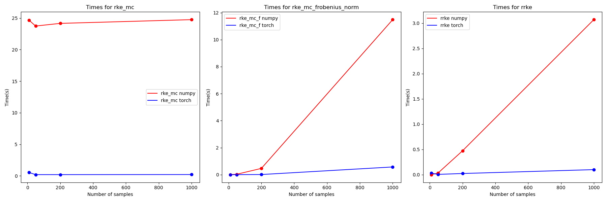

# Renyie Kernel Entropy-PyTorch

## Overview
This repository contains an optimized implementation of the Relative Kernel Entropy (RKE) score using PyTorch. The PyTorch implementation leverages GPU acceleration and parallel computing to significantly speed up the computation of RKE scores for large datasets. 

The main repository for the paper is <a href='https://github.com/mjalali/renyi-kernel-entropy/tree/main'>here</a>.

## Parallelization with PyTorch
To enhance the computational efficiency, the RKE score calculation is implemented using PyTorch. By utilizing the parallel computing capabilities of GPUs, this implementation can handle large datasets more efficiently compared to the traditional NumPy-based approach. This parallelization helps in reducing computation time while maintaining the accuracy of the results.

## Results
### Setting
The following seeting has been used for the comparrison:
```python
number_of_samples = [10,50,200,1000]
feature_dim = 1000
bandwiths = [8,20,100]
real_features = np.random.normal(loc=0.0, scale=1.0,
                                    size=[num_real_samples, feature_dim])

fake_features = np.random.normal(loc=0.01, scale=1.01,
                                size=[num_fake_samples, feature_dim])
```
### Computation Time Comparison
The following plots show the computation time for RKE scores using both NumPy and PyTorch implementations. The PyTorch implementation demonstrates a significant speedup, especially for larger datasets.



### Offset Comparison
The table below shows the average offset values between the original NumPy-based RKE implementation and the PyTorch-based implementation, proving the accuracy of the PyTorch implementation. (The error is mainly due to the randomness of the sampling)

| Method                  | Offset |
|-------------------------|--------|
| `rke_mc`                | *0.739%*|
| `rke_mc_frobenius_norm` | *5.53e-12%*|
| `rrke`                  | *0.005%*|


## Example Code
Here is an example script demonstrating how to use the `RKE` class for computing RKE scores and comparing the performance of the NumPy and PyTorch implementations.

```python
import numpy as np
from RKEtorch import RKE


num_real_samples = num_fake_samples = 10000
feature_dim = 1000

real_features = np.random.normal(loc=0.0, scale=1.0,
                                 size=[num_real_samples, feature_dim])

fake_features = np.random.normal(loc=0.0, scale=1.0,
                                 size=[num_fake_samples, feature_dim])

kernel = RKE(kernel_bandwidth=[0.2, 0.3, 0.4])


print(kernel.compute_rke_mc(fake_features))
print(kernel.compute_rrke(real_features, fake_features))
```
